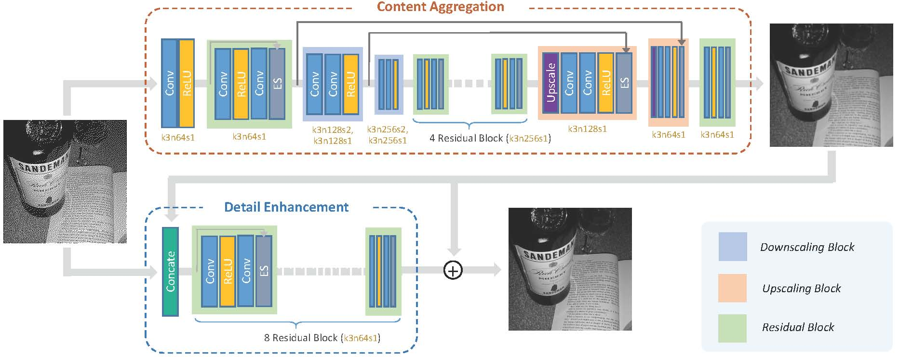
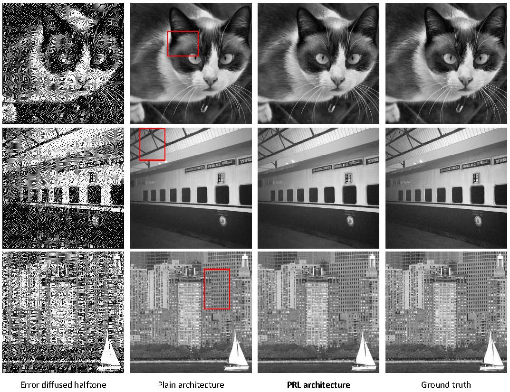

## Deep Inverse Halftoning

We run this code under [TensorFlow](https://www.tensorflow.org) 1.6 on Ubuntu16.04 with python pakage IPL installed.

### Network Architecture

TensorFlow Implementation of our paper ["Deep Inverse Halftoning via Progressively Residual Learning"](http://menghanxia.github.io/papers/2018_Inverse_Halftone_accv.pdf) accepted to ACCV 2018.

<div align="center">
	
</div>

### Results

<div align="center">
	
</div>

### Preparation

- You can apply existing halftone algorithms (e.g., [*Foyd-Steinberg Error diffusion*](https://en.wikipedia.org/wiki/Floyd%E2%80%93Steinberg_dithering) as did in our experiments) on grayscale images to generate binary halftone version of them, then you obtain training pairs <halftone, grayscale>.
- The patch size is set to 256x256 in the [`model.py`](model.py) (you may change it to any other size as you like).
- Download the pretrained VGG19 model in [here](https://mega.nz/#!xZ8glS6J!MAnE91ND_WyfZ_8mvkuSa2YcA7q-1ehfSm-Q1fxOvvs).

### Train
- Set hyperparameters in [`main.py`](main.py).
- Start training.
```bash
python3 main.py --mode train --train_dir 'training_image_dir' --val_dir 'val_image_dir'

```
### Test
- Download the [pretrained model](https://drive.google.com/open?id=11wXkRgM-D55biKUPGz7EiSt1TR-1q2iA ) and place it in the folder *"./checkpoints"*.
- Start evaluation and the result will be saved in the folder *"./output"*.
```bash
python3 main.py --mode test --test_dir 'testing_image_dir'
```

### Copyright and License
You are granted with the [license](./LICENSE.txt) for both academic and commercial usages.

### Citation
If any part of our paper and code is helpful to your work, please generously cite with:
```
@inproceedings{XiaW18,
  author    = {Menghan Xia and Tien-Tsin Wong},
  title     = {Deep Inverse Halftoning via Progressively Residual Learning},
  booktitle = {Asian Conference on Computer Vision (ACCV)},
  year      = {2018}
}
```
